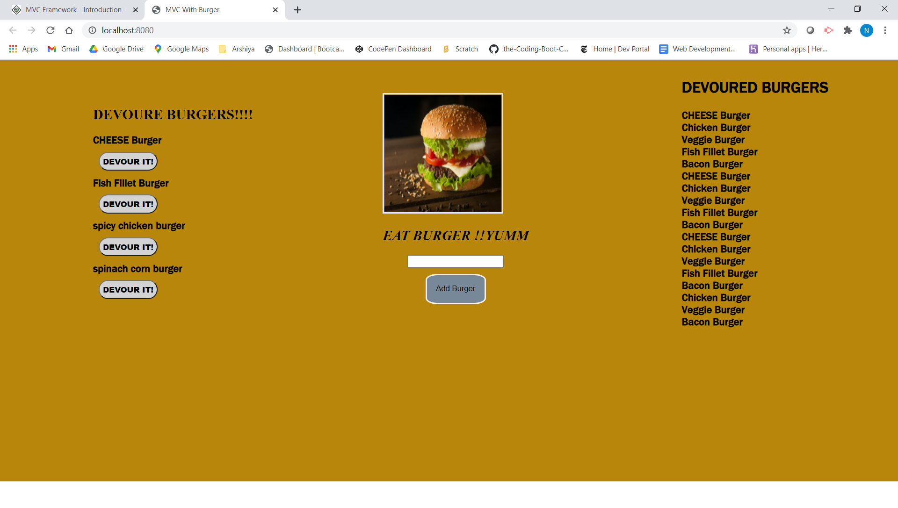

# ABOUT 

In this **application** , worked with **SQL**,**HANDLEBARS**,
and created the folder and file structure in **MVC** which stands for
**MODEL VIEW CONTROLLER**  and also deployed our application on **HEROKU**

# TABLE OF CONTENTS
[ DESCRIPTION](#DESCRIPTION)

[INSTALLATION](#INSTALLATION)

[TEXT-EDITOR](#TEXT-EDITOR)

[PROGRAMMING-LANGUAGE](#PROGRAMMING-LANGUAGE)

[RESOURCES-REFERRED](#RESOURCES-REFERRED)

[SCREENSHOT](#SCREENSHOT)

[GIT_HUB-REPOSITORY](#GIT_HUB-REPOSITORY)

[ HEROKU-LINK](#HEROKU-LINK) 

# DESCRIPTION

In this application , user will see the **BURGER APP** by running
**node server.js** command on the terminal and listening to the port.
After,  connecting to the database, user will open the application the browser
via **local host and the mentioned Port Number**. User will easily add the burger name according to its liking by clicking on the **ADD THE BURGER** Button.
They can see the **added** burger name under **DEVOURE BURGER** section. User can easily, **devoured** the burger by clicking on the **DEVOURE IT** button and can see the selected burger under the **DEVOURED** section.User must have all **DEPENDENCIES** before running the application.

# INSTALLATION

**npm install express**
**npm install express-handlebars**
**npm install mysql**

# STRUCTURE OF MVC

## TEXT-EDITOR
**Vs-code**

## PROGRAMMING-LANGUAGE

CSS

JAVASCRIPT

HTML via HANDLEBARS

# RESOURCES-REFERRED
[HANDLEBARS](https://handlebarsjs.com/)

[MVC](https://www.tutorialspoint.com/mvc_framework/mvc_framework_introduction.htm)

[MODZELLA-MVC](https://developer.mozilla.org/en-US/docs/Glossary/MVC)

# SCREENSHOT

# GIT_HUB-REPOSITORY
[GIT-HUB](https://github.com/nehreetkaur/burger)

# HEROKU-LINK
[HEROKU-LINK]()